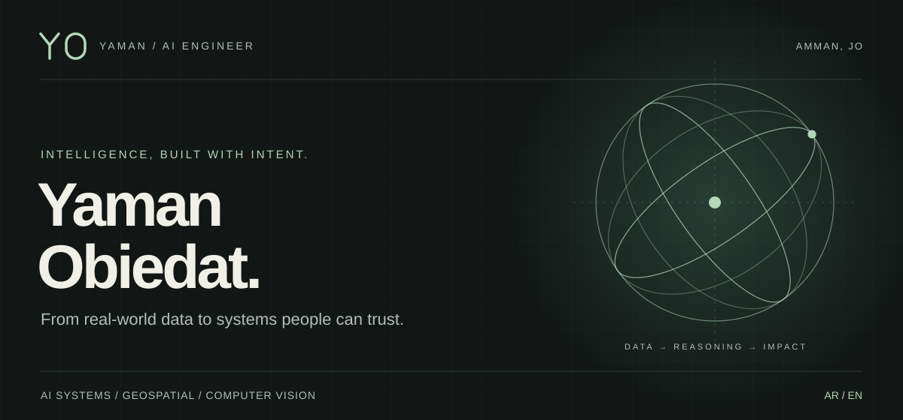
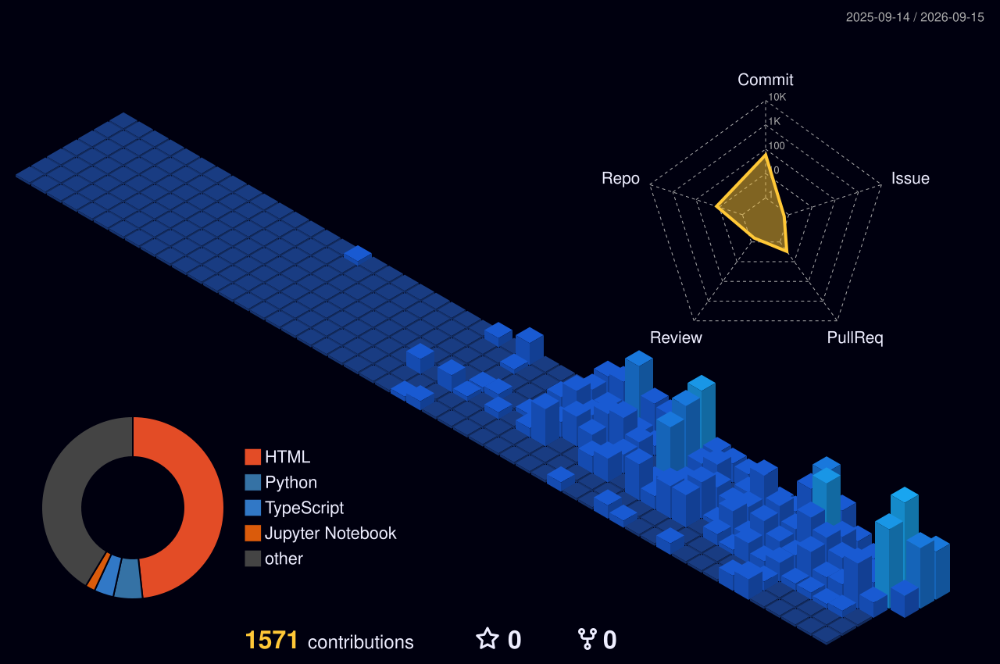
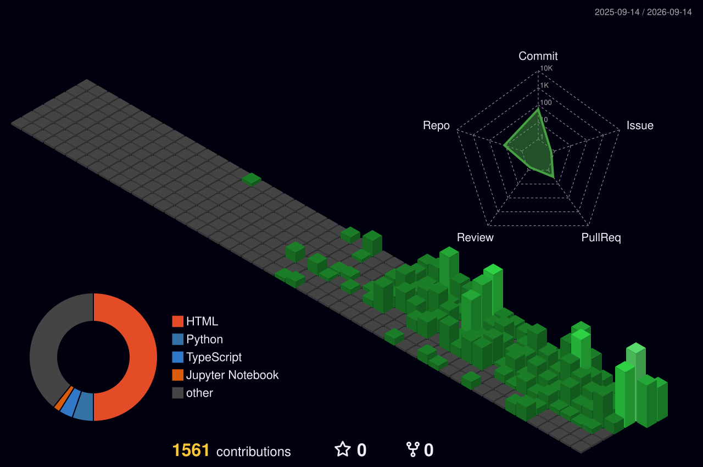
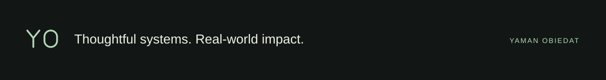

  

<table>
<tr>
<td width="56%" valign="top">

I build AI systems for the public sector in Jordan — the kind that have to survive a real audit, not just a demo.

My work sits where <b>LLM agents meet hard, verifiable data</b>: routable road networks, Arabic NLP, and computer vision. The engineering problem I care about most is <b>refusal</b> — designing systems that decline to answer when the evidence isn't there, instead of inventing a number.

Everything I ship is bilingual and RTL-first, because the people using it read Arabic.

</td>
<td width="44%" valign="top">

<b>B.Sc. Data Science &amp; Artificial Intelligence</b> Yarmouk University

<b>AI Developer — 9xAI Program</b> Al-Hussein Technical University (HTU)

<b>Amman, Jordan</b> Arabic · English · RTL-first engineering

</td>
</tr>
</table>

## ▍Flagship — Traffic Intelligence Platform

<table>
<tr>
<td width="25%" valign="top"><b>PROBLEM</b> Planners need to know what a road closure does to the network <i>before</i> it happens.</td>
<td width="25%" valign="top"><b>APPROACH</b> A hierarchical multi-agent system answering in Arabic or English over a routable OpenStreetMap graph.</td>
<td width="25%" valign="top"><b>SCALE</b> <b>135k</b> routable car edges <b>99k</b> graph vertices</td>
<td width="25%" valign="top"><b>GUARANTEE</b> A critic gates every response. No claim ships without evidence behind it.</td>
</tr>
</table>

  

> *“What happens if University Street closes?”* — the system resolves the street name in Arabic, re-routes across the corridor registry, and either answers **with the evidence attached**, or refuses and **names the evidence it does not have**. It never fills the gap with a plausible number.

<code>TypeScript</code> · <code>NestJS</code> · <code>PostgreSQL</code> · <code>PostGIS</code> · <code>pgRouting</code> · <code>Ollama</code>

## ▍Selected systems

<table>
<tr>
<td width="33%" valign="top"><b>🗣️ VOC-360 · صوت المواطن</b> <b>ARABIC NLP · CIVIC PLATFORM</b></td>
<td width="33%" valign="top"><b>🛸 Aerial Traffic Analysis</b> <b>COMPUTER VISION · TRANSPORT</b></td>
<td width="33%" valign="top"><b>🌱 AgriBot AI</b> <b>EDGE ML · GRADUATION PROJECT</b></td>
</tr>
<tr>
<td valign="top">Complaint intake and analysis for Jordanian ministries.</td>
<td valign="top">Raw drone footage turned into usable transport data.</td>
<td valign="top">Crop and fertilizer recommendation from IoT sensor data.</td>
</tr>
<tr>
<td valign="top">Clustering and causal analysis sit behind cross-ministry role-based access — and the findings leave the system as Arabic PDF reports officials can circulate and file.</td>
<td valign="top">Detection, multi-object tracking and zone occupancy produce origin–destination flows and speeds calibrated against ground truth, not raw pixel counts.</td>
<td valign="top">Runs on-device on a Raspberry Pi. XGBoost 99% and Random Forest 94% on the project's sensor dataset — graduation evaluation figures, not a production deployment.</td>
</tr>
<tr>
<td valign="top"><code>React</code> <code>FastAPI</code> <code>PostgreSQL</code> <code>Docker</code></td>
<td valign="top"><code>Python</code> <code>YOLO</code> <code>Supervision</code> <code>OpenCV</code></td>
<td valign="top"><code>Python</code> <code>XGBoost</code> <code>scikit-learn</code></td>
</tr>
</table>

## ▍Engineering capability

<table>
<tr>
<td width="20%" valign="top"><b>SYSTEMS &amp; DATA</b></td>
<td valign="top"><code>TypeScript</code> <code>NestJS</code> <code>FastAPI</code> <code>PostgreSQL</code> <code>Docker</code> <code>Raspberry Pi</code> Service architecture, relational modelling, containerised and on-device deployment.</td>
</tr>
<tr>
<td valign="top"><b>GEOSPATIAL</b></td>
<td valign="top"><code>PostGIS</code> <code>pgRouting</code> <code>OpenStreetMap</code> Routable graph construction and shortest-path analysis over a 135k-edge road network.</td>
</tr>
<tr>
<td valign="top"><b>AI &amp; VISION</b></td>
<td valign="top"><code>Ollama</code> <code>Arabic NLP</code> <code>YOLO</code> <code>Supervision</code> <code>OpenCV</code> <code>XGBoost</code> <code>scikit-learn</code> Multi-agent orchestration, evidence gating, detection and multi-object tracking.</td>
</tr>
<tr>
<td valign="top"><b>INTERFACE</b></td>
<td valign="top"><code>React</code> <code>RTL / bilingual UI</code> <code>Arabic PDF reporting</code> Right-to-left layout as a first-class constraint, not a translation pass.</td>
</tr>
</table>

## ▍Activity

Contribution rendering — supporting activity, not a measure of the systems above.

  
  

  <picture>
    <source media="(prefers-color-scheme: dark)" srcset="https://raw.githubusercontent.com/YAMANOE/YAMANOE/output/github-snake-dark.svg" />
    <source media="(prefers-color-scheme: light)" srcset="https://raw.githubusercontent.com/YAMANOE/YAMANOE/output/github-snake.svg" />
    
  </picture>

## ▍Contact

  
  
  

  

