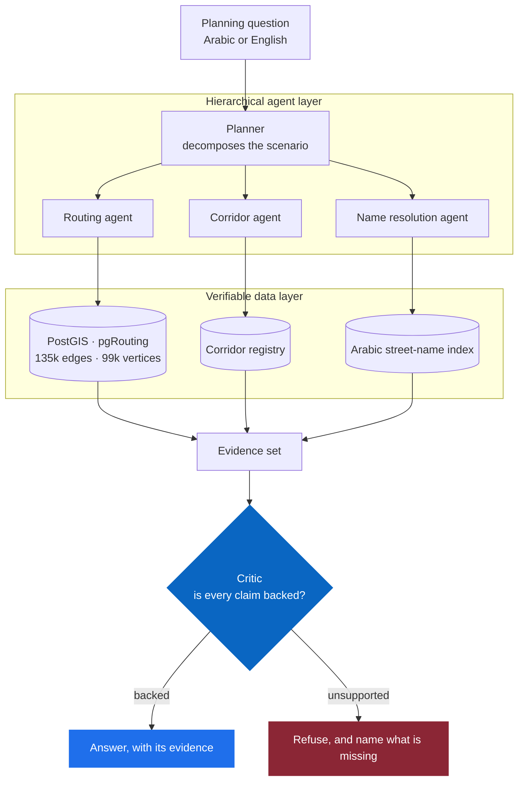
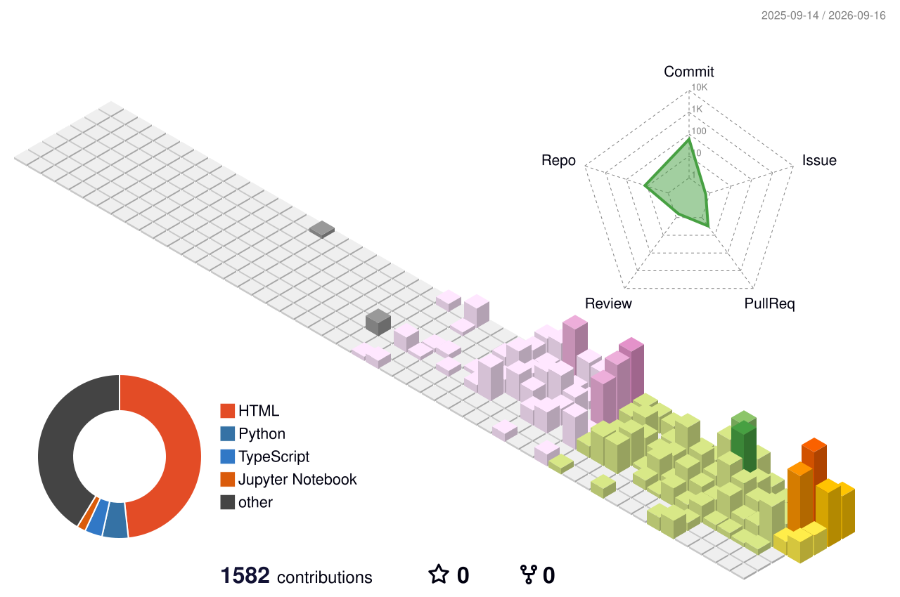
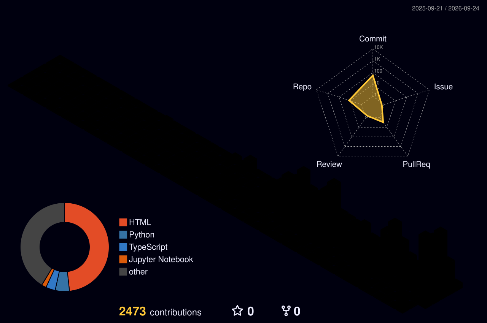
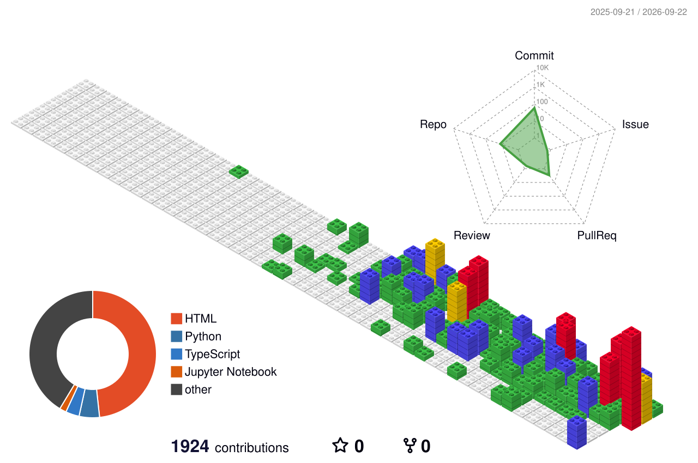

  

  

  
  

  <b>B.Sc. Data Science &amp; Artificial Intelligence</b>, Yarmouk University · <b>AI Developer</b>, 9xAI Program @ HTU

---

I build AI systems for the public sector in Jordan — the kind that have to survive a real audit, not just a demo.

My work sits where **LLM agents meet hard, verifiable data**: routable road networks, Arabic NLP, and computer vision. The engineering problem I care about most is **refusal** — designing systems that decline to answer when the evidence isn't there, instead of inventing a number. Everything I ship is bilingual and RTL-first, because the people using it read Arabic.

---

## Selected work

### 🚦 Traffic Intelligence Platform — Amman

A hierarchical multi-agent system that answers real transport-planning questions: *"what happens if University Street closes?"*

It runs over a routable OpenStreetMap graph in PostGIS + pgRouting — **135k car edges, 99k vertices** — with a corridor registry and Arabic street-name resolution. Every answer passes a critic layer that rejects any claim without evidence behind it, so the system returns a refusal and names the gap rather than a plausible-looking number.

`TypeScript` `NestJS` `PostgreSQL/PostGIS` `pgRouting` `Ollama`

---

### 🗣️ VOC-360 (صوت المواطن) — multi-ministry citizen feedback

A complaint intake and analysis platform serving Jordanian ministries. Arabic NLP pipeline, clustering, and causal analysis over free-text citizen complaints, behind cross-ministry role-based access, with Arabic PDF reporting for officials who need the output on paper.

`React` `FastAPI` `PostgreSQL` `Arabic NLP` `Docker`

### 🛸 Aerial Traffic Analysis

Turns raw drone footage into transport data: detection, multi-object tracking, zone occupancy, origin–destination flows, and speeds calibrated against ground truth.

`Python` `Supervision` `YOLO` `OpenCV`

### 🌱 AgriBot AI

Crop prediction and fertilizer recommendation from IoT sensor data, running on-device on a Raspberry Pi. XGBoost at 99% accuracy, Random Forest at 94%.

`Python` `XGBoost` `scikit-learn` `Raspberry Pi`

Public repositories for selected projects are in preparation.

---

## Stack

  

  Beyond the icons — <b>PostGIS</b> · <b>pgRouting</b> · <b>Arabic NLP</b> · <b>YOLO / Supervision</b> · <b>Ollama</b> · <b>RTL interface design</b>

---

## Contributions in 3D

  
  

  
  

### 🐍 Snake

<picture>
  <source media="(prefers-color-scheme: dark)" srcset="https://raw.githubusercontent.com/YAMANOE/YAMANOE/output/github-snake-dark.svg" />
  <source media="(prefers-color-scheme: light)" srcset="https://raw.githubusercontent.com/YAMANOE/YAMANOE/output/github-snake.svg" />
  
</picture>

---

## Contact

  
  

  

