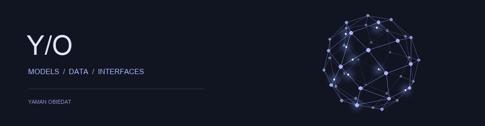

<picture>
  <source media="(prefers-reduced-motion: reduce)" srcset="assets/network-3d-static.png">
  
</picture>

<picture>
  <source media="(prefers-reduced-motion: reduce)" srcset="assets/profile-static.svg">
  
</picture>

[RegTech](https://github.com/YAMANOE/rag-tech) · [NextGen Recommender](https://github.com/YAMANOE/recom_sys) · [NLP study](https://github.com/YAMANOE/nlp_pro1)

Projects and my contributions

### VOC-360 — Civic intelligence
Built deep root-cause orchestration, custom agents, evidence checks, SOP retrieval integration, citizen survey workflows, and Arabic PDF reporting. Added server-side insight review and improved sector isolation.

### Pulga — Crisis intelligence
Built the Agent Council swarm and database foundation. Redesigned bilingual interfaces and connected them to APIs. Added research-backed debate, human review, and executive reporting.

### Moodle People & Enrolment
Built enrolment APIs, capability checks, cohort and role-preserving enrolment behavior, and bilingual management interfaces. Implemented idempotent video-event ingestion and watch-quality metrics. The report distinguishes merged work from later unmerged changes.

### TashreeatCom / RegTech V3
Jordanian law search, Legal Twin exploration, bilingual assistance, obligation extraction, and conflict analysis. The supplied system report identifies Next.js 15, FastAPI, PostgreSQL, Neo4j and Gemini. It does not establish my individual authorship. The architecture image below the project directory describes the earlier public RegTech version.

### More projects
- Traffic Intelligence: bilingual routing and corridor analysis with evidence checks.
- [NextGen Recommender](https://github.com/YAMANOE/recom_sys): hybrid retrieval and recommendation explanations.
- Aerial Traffic Analysis: drone-based tracking, zone occupancy and calibrated speeds.
- AgriBot AI: IoT-based crop and fertilizer recommendations; Raspberry Pi graduation project.
- Intelligent Traffic Light: team project combining SUMO and YOLO for Wadi Saqra.
- Government Control Tower: team project with agents and human review; knowledge and governance services remain planned.
- [Toxic Text Classification](https://github.com/YAMANOE/nlp_pro1): BiLSTM and LoRA-tuned DistilBERT evaluations.
- [Mini-RAG](https://github.com/YAMANOE/mini-rag-1): course-based learning project.

<picture>
  <source media="(prefers-reduced-motion: reduce)" srcset="assets/snake-static.svg">
  
</picture>

<picture>
  <source media="(prefers-reduced-motion: reduce)" srcset="assets/footer-static.svg">
  
</picture>
