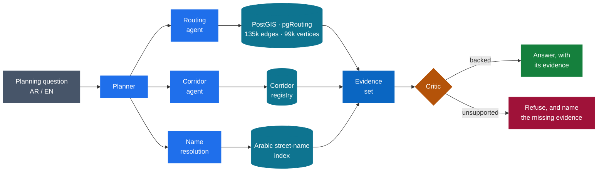

  

  <b>B.Sc. Data Science &amp; Artificial Intelligence</b>, Yarmouk University · <b>AI Developer</b>, 9xAI Program @ HTU

  <b>Multi-agent systems that refuse to guess</b> · Computer vision &amp; Arabic NLP 
  Civic technology for the public sector · PostGIS · pgRouting · LLM agents

---

I build AI systems for the public sector in Jordan — the kind that have to survive a real audit, not just a demo.

My work sits where **LLM agents meet hard, verifiable data**: routable road networks, Arabic NLP, and computer vision. The engineering problem I care about most is **refusal** — designing systems that decline to answer when the evidence isn't there, instead of inventing a number. Everything I ship is bilingual and RTL-first, because the people using it read Arabic.

---

## Selected work

### 🚦 Traffic Intelligence Platform

*Hierarchical multi-agent transport planning · Amman*

Answers real planning questions — *"what happens if University Street closes?"* — over a routable OpenStreetMap graph in PostGIS + pgRouting (**135k car edges, 99k vertices**), with a corridor registry and Arabic street-name resolution.

Every response passes a critic layer that rejects any claim without evidence behind it. When the graph can't support an answer, the system says so and names the missing evidence rather than returning a plausible number.

`TypeScript` `NestJS` `PostgreSQL/PostGIS` `pgRouting` `Ollama`

---

### 🗣️ VOC-360 · صوت المواطن

*Citizen feedback intake and analysis · multi-ministry deployment*

An Arabic NLP pipeline over free-text citizen complaints — clustering and causal analysis behind cross-ministry role-based access.

Built around how the institution actually works: findings leave the system as Arabic PDF reports officials can circulate and file.

`React` `FastAPI` `PostgreSQL` `Arabic NLP` `Docker`

---

### 🛸 Aerial Traffic Analysis

*Drone footage to transport data · computer vision pipeline*

Detection, multi-object tracking, and zone occupancy from raw aerial footage.

Output is planning-grade rather than illustrative: origin–destination flows and speeds calibrated against ground truth, not raw pixel counts.

`Python` `Supervision` `YOLO` `OpenCV`

---

### 🌱 AgriBot AI

*Graduation Project · on-device crop intelligence*

Crop prediction and fertilizer recommendation from IoT sensor data, running on a Raspberry Pi rather than off-device.

On the project's sensor dataset, XGBoost reached 99% accuracy and Random Forest 94% — figures from the graduation evaluation, not a production deployment.

`Python` `XGBoost` `scikit-learn` `Raspberry Pi`

---

## Engineering stack

  <b>SYSTEMS &amp; DATA</b> 
  

  <b>AI &amp; VISION</b> 
  

  <b>INTERFACE</b> 
  

  Beyond the icons — <b>PostGIS</b> · <b>pgRouting</b> · <b>Arabic NLP</b> · <b>YOLO / Supervision</b> · <b>Ollama</b> · <b>RTL interface design</b>

---

## Contributions in 3D

  
  

  Seasonal cycle · commit blocks — both animated, regenerated daily by GitHub Actions

 

  <picture>
    <source media="(prefers-color-scheme: dark)" srcset="https://raw.githubusercontent.com/YAMANOE/YAMANOE/output/github-snake-dark.svg" />
    <source media="(prefers-color-scheme: light)" srcset="https://raw.githubusercontent.com/YAMANOE/YAMANOE/output/github-snake.svg" />
    
  </picture>

---

## Contact

  
  
  

  

